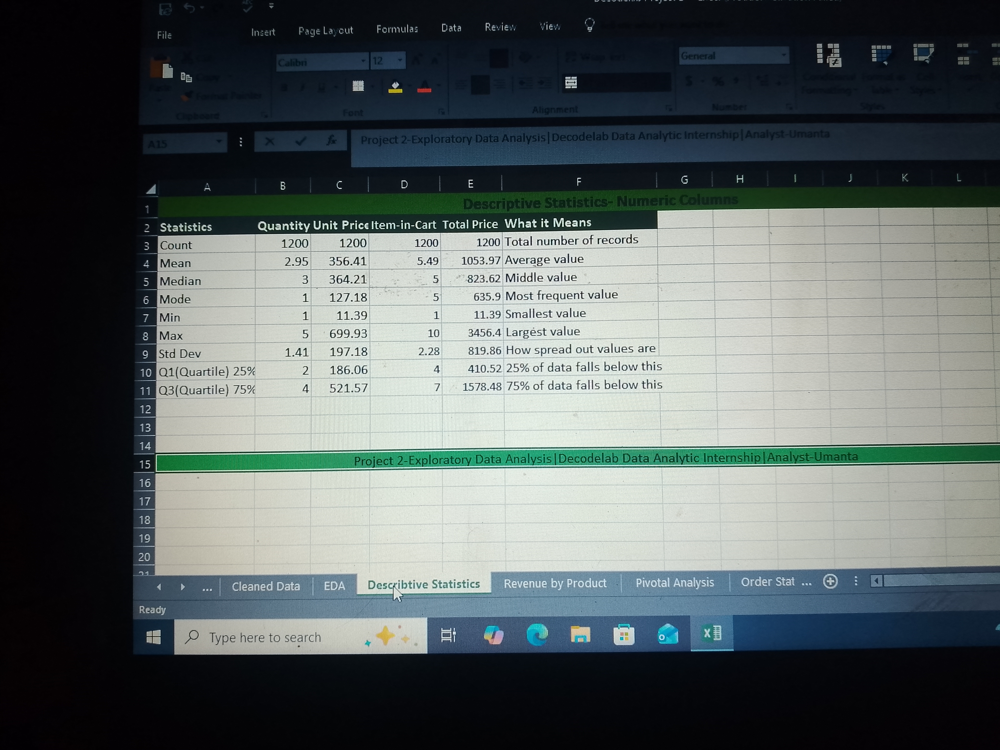
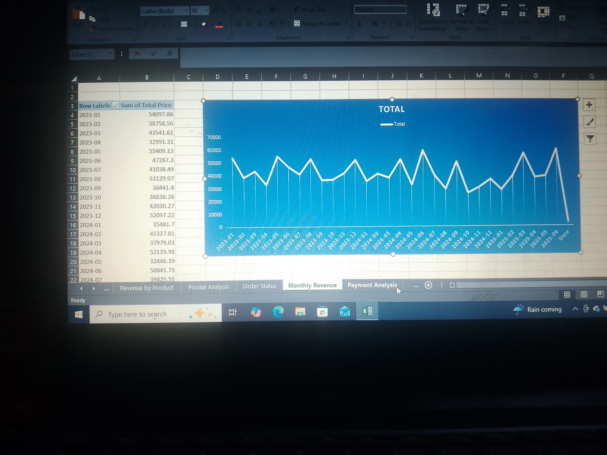
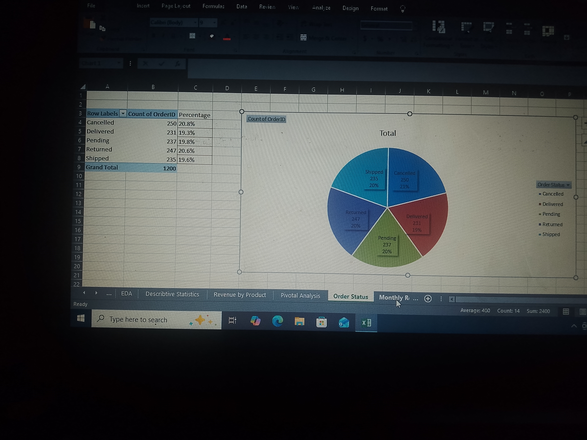
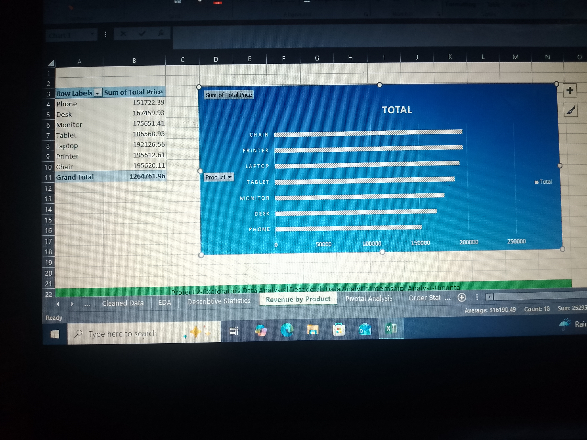
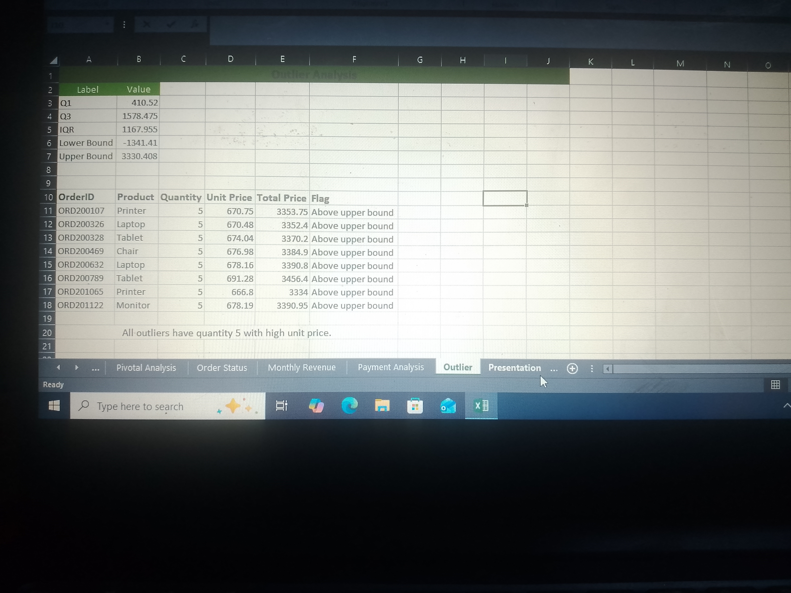

# DecodeLabs Internship Projects Portfolio

## Overview
This repository contains two data analysis projects completed 
using Microsoft Excel during my DecodeLabs internship. The 
projects focus on data cleaning, preparation, and exploratory 
data analysis (EDA) to generate meaningful insights from 
real-world sales datasets.

---

## Project 1: Data Cleaning and Preparation

### Project Description
The purpose of this project was to clean and prepare raw 
sales data for analysis using Microsoft Excel and Power Query. 
Several data quality issues such as duplicates, missing values, 
inconsistent formatting, and incorrect data types were 
identified and corrected.

### Objectives
- Improve overall data quality
- Remove duplicate records
- Handle missing values
- Standardize data formats
- Prepare the dataset for analysis and reporting

### Tools Used
- Microsoft Excel
- Power Query

### Dataset Information
Two real-world sales datasets containing 1,500 and 1,200 rows 
of business and operational records used for analytical 
reporting and data-driven decision-making.

### Data Cleaning Process
The following cleaning operations were performed using 
Power Query:
1. Removed duplicate rows
2. Handled missing values
3. Standardized text formatting
4. Changed incorrect data types
5. Renamed columns for consistency
6. Structured the dataset for analysis

---

## Messy Dataset
Initial raw dataset before cleaning and transformation.

---

### Power Query Techniques Used
- Remove Duplicates
- Replace Values
- Change Data Types
- Additional Columns
- Filtering and Sorting
- Data Transformation

### Power Query Transformation Steps
The following steps were applied in Power Query to clean 
and transform the dataset:

1. Connected to the raw Excel data source
2. Promoted first row as headers
3. Removed duplicate rows
4. Replaced missing/null values with appropriate defaults
5. Changed column data types to correct formats
6. Renamed columns for clarity and consistency
7. Removed irrelevant or empty columns
8. Filtered out invalid or erroneous records
9. Sorted data for better readability
10. Loaded cleaned data back into Excel

---

## Cleaned Dataset
Dataset after cleaning and preparation using Power Query.

---

### Challenges Faced
- Missing values across multiple columns
- Duplicate records affecting data integrity
- Inconsistent formatting
- Incorrect data types

### Outcome
The raw datasets were successfully transformed into clean, 
organized, and analysis-ready datasets suitable for reporting 
and further analysis.

---

## Project 2: Exploratory Data Analysis (EDA)

### Project Description
This project focuses on exploring and analyzing a sales 
dataset using Microsoft Excel to identify trends, patterns, 
relationships, and business insights.

### Objectives
- Analyze trends and patterns in the dataset
- Summarize data using descriptive statistics
- Perform quartile analysis to detect outliers
- Identify key performance observations

### Tools Used
- Microsoft Excel
- Pivot Tables
- Descriptive Statistics
- Quartile Calculations

### Analysis Performed
- Descriptive statistical analysis
- Monthly revenue analysis
- Order status analysis
- Outlier detection
- Revenue by payment method
- Quartile calculations

### Analytical Techniques Used
- Mean, Median, and Mode
- Minimum and Maximum Values
- Standard Deviation
- Quartile Analysis
- Frequency Distribution
- Pivot Table Summarization
- Data Filtering and Sorting

---

## Basic Descriptive Statistics
Summary statistics used to understand the dataset distribution.

---

## Monthly Revenue
Monthly revenue analysis to identify trends over time.

---

## Order Status
Distribution of order statuses across the dataset.

---

## Outliers
Detection of outlier orders based on total price.

---

## Revenue by Products 
Revenue breakdown across different product categories.

---

## Quartile Analysis
Quartile calculations used to identify data distribution 
and outliers.

---

### Key Insights
- Average order value was ₦1,053.97
- Chair and Printer were the top revenue-generating products
- Credit Card had the highest average spend at ₦1,127.55
- 8 orders were flagged as outliers above ₦3,330.41
- Order statuses were evenly distributed across all categories

### Challenges Faced
- Inconsistent formatting before analysis
- Organizing large volumes of data
- Data preparation before analysis

### Outcome
The exploratory data analysis provided meaningful insights 
and improved understanding of the dataset through statistical 
summaries and trend analysis.

---

## Author
Umanta — Data Analytics Intern
